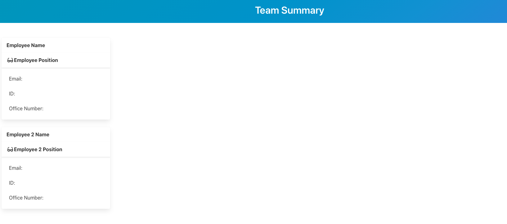
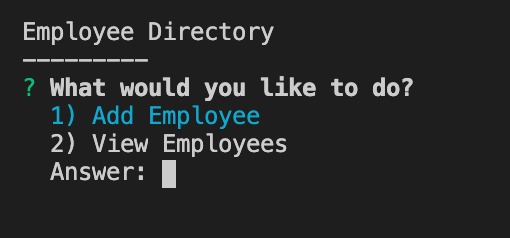

# Employer_Summary_Engine

## Description

application will prompt the user for information about the team manager and then information about the team members. The user can input any number of team members, and they may be a mix of engineers and interns. When the user has completed building the team, the application will create an HTML file that displays a nicely formatted team roster based on the information provided by the user.

## Table of Contents

- Installation
- Usage
- License
- Contributors
- Tests
- Questions

## Installation

Download the GitHub repository here: https://github.com/icecicle04/Employer_Summary_Engine and then run the app with the command "npm start"

## Usage

Add employees to a basic HTML page in order to get a view of all your employees.

## Licenses

MIT License

## Contributors

Ali Khan

## Tests

Tested on Local Host

## Questions

email Ali.Khan4990@gmail.com

